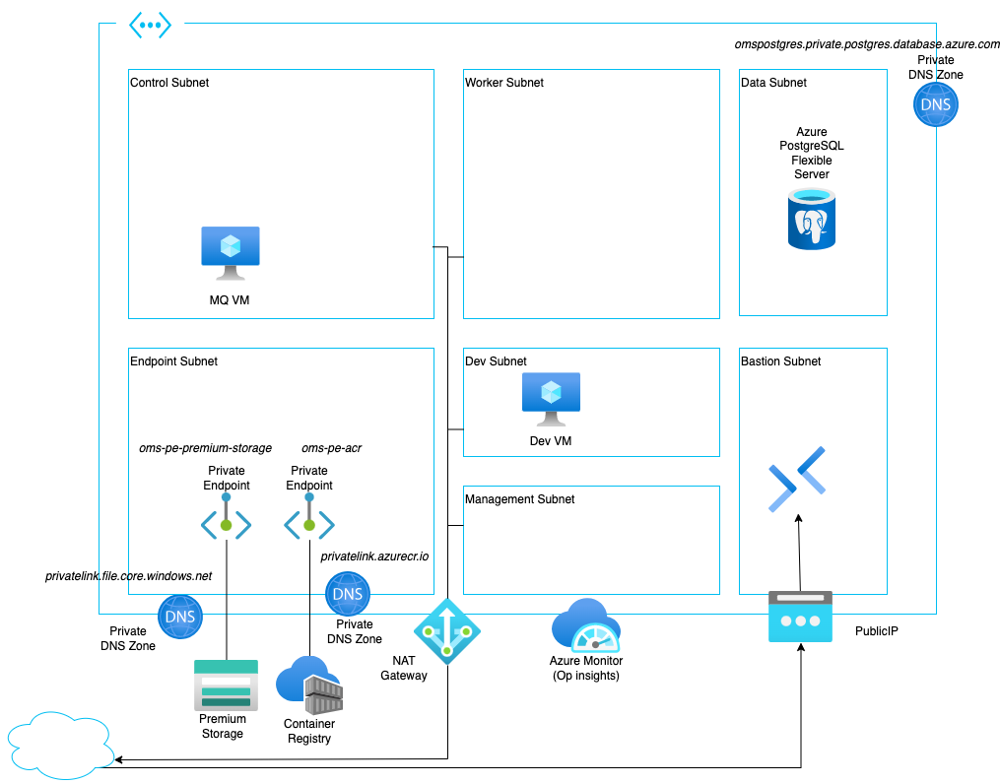

# Sterling OMS on Azure ARM Templates

This repository contains ARM Templates to deploy IBM Sterling OMS onto a variety of architectures.

# Base

[template](./Base)

A basic Sterling OMS deployment for production with public endpoint for access to the Sterling application and private endpoints internally for database and JMS Broker.

- Sterling OMS on Azure Redhat Openshift (ARO) 
- Apache ActiveMQ on VM
- Azure PostgresSQL database service
- Azure Bastion service
- Container registry service
- Virtual Network Gateway for ExpressRoute or VPN access

This is the current status of this template:
